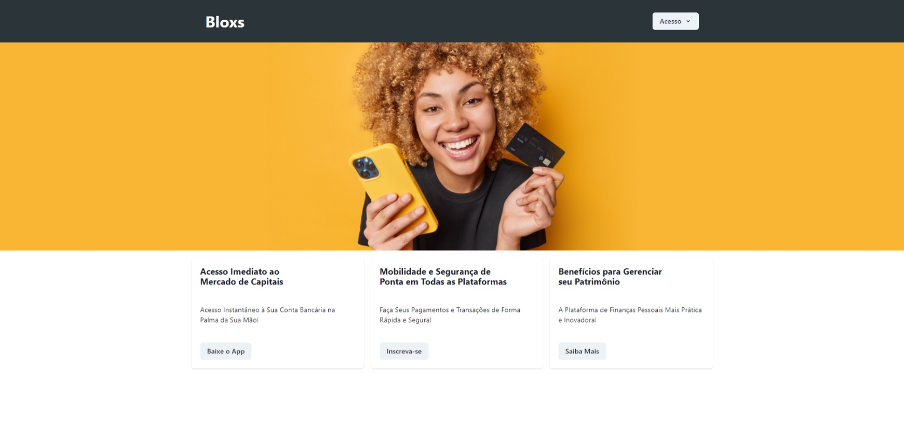
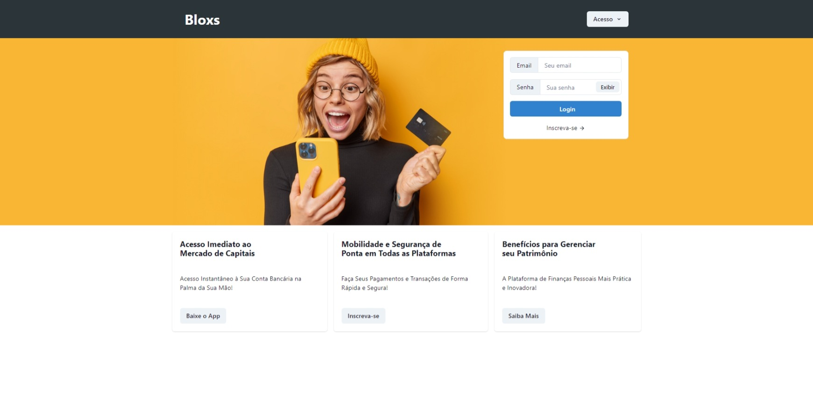
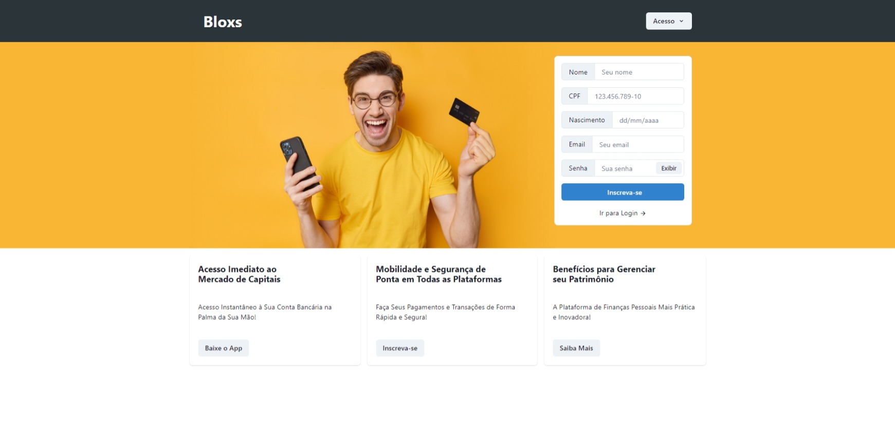
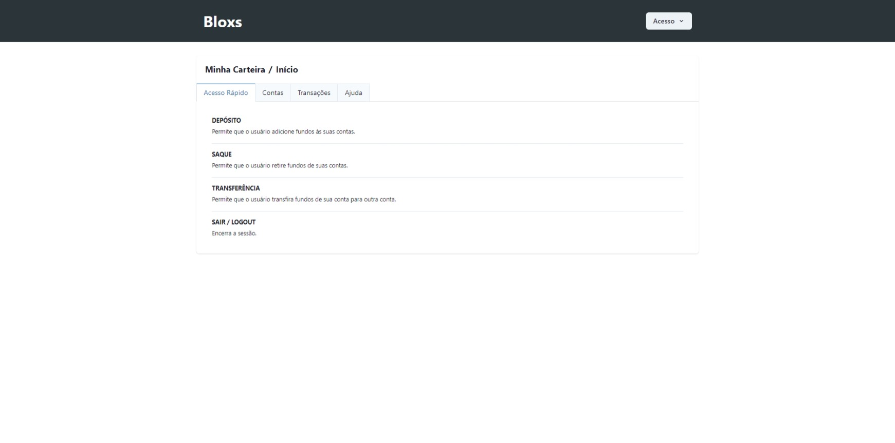

# My Bank
## Desafio Full-Stack Developer (Python/Flask) Bloxs

O projeto full stack utilizou Flask com SQLAlchemy e MySQL como backend e React com Router e Redux como front, consistindo em uma aplicação web para gerenciar tarefas bancárias.

### Flask e SQLAlchemy

Na parte do backend, Flask foi utilizado para criar uma API RESTful que se comunica com o banco de dados MySQL através do SQLAlchemy. A API foi estruturada em rotas para cada operação necessária para a aplicação, e utilizou autenticação por token JWT para garantir segurança na comunicação com o frontend.

### Docker

Para containerizar o backend, foi criado um arquivo Dockerfile que especificava as dependências necessárias para a aplicação. Além disso, foi utilizado um docker-compose.yml para orquestrar a comunicação entre os diferentes containers, incluindo o banco de dados MySQL.

### React, Redux e Router

Já na parte do frontend, React foi utilizado para criar uma interface intuitiva e responsiva para o usuário. O React Router foi utilizado para controlar as rotas da aplicação, enquanto o Redux foi utilizado para gerenciar o estado da aplicação e garantir a consistência dos dados.

### TypeScript

O uso do TypeScript foi incrível para um projeto React com Redux e Router. Ele nos permitiu criar códigos mais robustos e organizados, além de proporcionar uma melhor experiência ao desenvolver aplicações web. O TypeScript foi fundamental para nos ajudar a lidar com as complexidades de trabalhar com Redux e Router.

---

## Instalação do Backend

Para executar o código do docker-compose fornecido, siga as instruções abaixo:

1. Certifique-se de que o Docker esteja instalado e em execução em sua máquina.
2. Abra um terminal e navegue até a pasta onde o arquivo docker-compose.yml está salvo.
3. Digite o seguinte comando no terminal para iniciar o container MySQL:

        docker-compose up -d

4. Aguarde alguns segundos para que o container seja criado e iniciado. Você pode verificar o status do container digitando o seguinte comando:

        docker ps

5. Se o container estiver em execução, você poderá acessar o MySQL usando o comando abaixo:

    mysql -h 127.0.0.1 -P 3307 -u bloxs -p

    Digite a senha de root definida na variável de ambiente MYSQL_ROOT_PASSWORD (bloxs123) para acessar o MySQL.
    Pronto! O MySQL está em execução em um container Docker e você pode utilizá-lo normalmente.

Observação: a porta do MySQL definida no arquivo docker-compose.yml é a 3307. Se você precisar mudá-la, altere a primeira parte do mapeamento de porta (antes do dois-pontos) para a porta que deseja usar.

--- 

##  Instalação do Frontend

1. Instale o Node.js e o npm no seu computador.
2. Execute o comando `npm install` para instalar todas as dependências do aplicativo.
3. Execute o comando `npm start` para iniciar o aplicativo.
4. O aplicativo React com Typescript deve ser executado e estar disponível em seu navegador.

## Telas

O presente projeto usou imagens livres do Freepik apenas para fins de demostração.
Página de login; página de cadastro; página inicial com "carteira" que resume contas e saldos; página de depósito; página de saque e página de transferência.

---

## Agradecimentos

Obrigado por ler a documentação! Sou Bráulio Silveira, meu perfil no LinkedIn é https://www.linkedin.com/in/bosilveira/ e sou um desenvolvedor full stack.